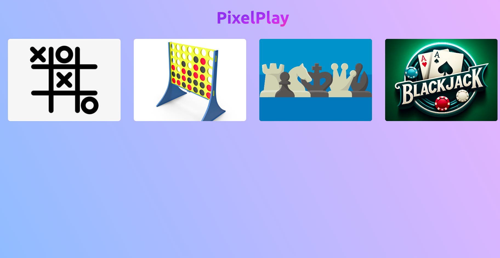
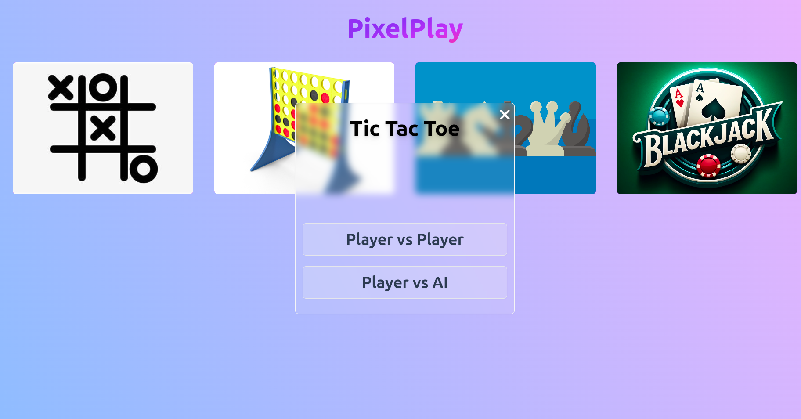
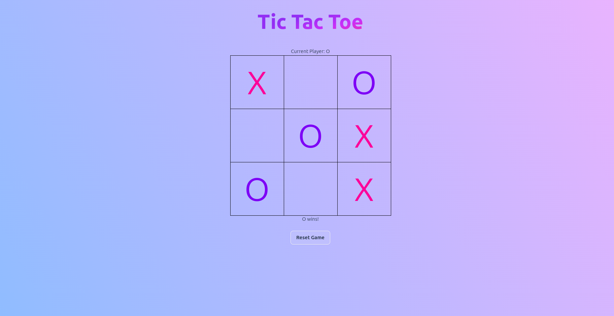
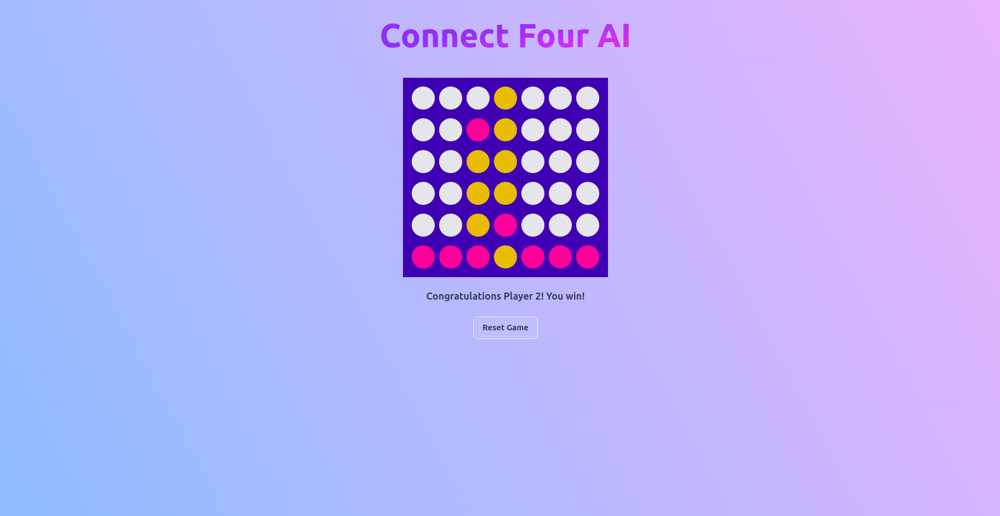
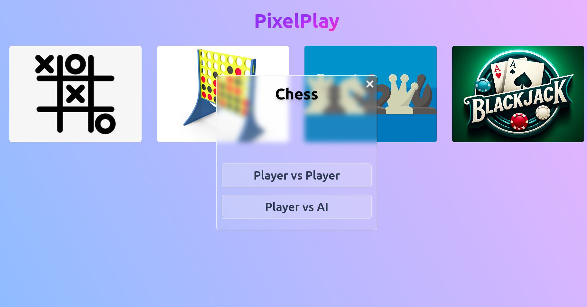
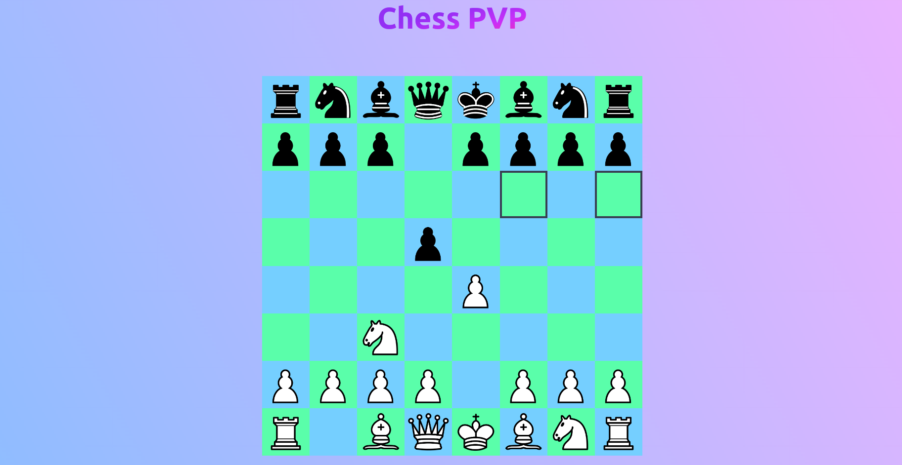
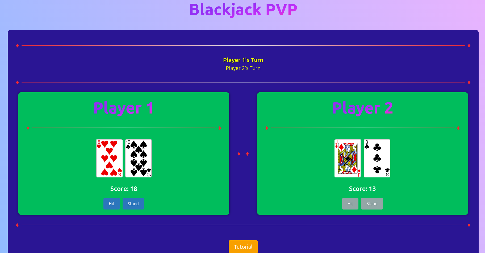
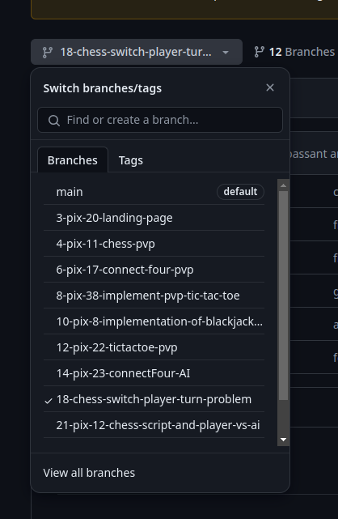

# PixelPlay

## Description

### 1. User Stories

1. As a user, I want to have a website where I can play games against my friends.
2. As a human, I want to prove my capabalities by defeating AI in various games.
3. As an amateur tic tac toe player, I want to play a tic tac toe game against my friends, to showcase my superior skills in the game.
4. As an amateur chess player, I want to play a chess game against my friend, so that I prove that I’m a better player.
5. As a professional chess player, I want to play chess against the computer, so that I can train and become a better player.
6. As an amateur player, I want to play Connect Four against a bot, so that I learn from my mistakes
7. As a professional tic tac toe player, I want to play a game of tic tac toe against an AI, so that I get better at the game
8. As a user, I want to be able to play Connect Four against my friend, so that we have fun together.
9. As an amateur blackjack player, I am feeling lucky and I want to enjoy myself with some games against my friend.
10. As a professional blackjack player, I want to play against the online dealer, so that I can be the best.

### 2. Backlog Creation

We have used [Jira](https://dumitresculeduard.atlassian.net/jira/software/projects/PIX/boards/2/backlog) for our backlog tracking system. Each deadline had its own sprint and in a sprint each task/story/bug had its own assignee.

Backlog Sprint


Backlog Timeline


### 3. Features List

- Playing *Tic Tac Toe* against friends
- Playing *Chess* against friends
- Playing *Connect Four* against friends
- Playing *Blackjack* against friends
- Playing *Tic Tac Toe* against AI
- Playing *Connect Four* against AI
- Playing *Chess* against AI
- Playing *Blackjack* against a dealer

### 4. App's behaviour description

On the landing page it can be seen all the games that the website provides. Each game when clicked on, shows a choice menu from which it can be picked the game mode that it want to be played: PVP or AI. For each game after the game mode is chosen, the URL switches to that game (e.g. /connect-four, /chess, /tic-tac-toe) and the website now shows the chosen one. Each game is fully functional and it can be played against a friend or against an AI. The games are: *Tic Tac Toe*, *Connect Four*, *Chess*, *Blackjack*.

### 5. App's appearance

The design we chose was *Minimalistic*. That is, the background is only a gradient colour and all the games follow that pattern.

**Landing Page**


**Tic Tac Toe**




**Connect Four**




**Chess**




**Blackjack**




### 6. UML User Flow Diagram

## Source Control

Branches: [PixelPlay Branches](https://github.com/skpha13/PixelPlay/branches)

Each feature had its own branch for implementation and enhancement, therefore, the main branch was always clean and fully functional. That meant a clean environment to work in and a great workflow. Furthermore, each reported bug had its own branch, as a result fixing the bug was cleaner and easier.
The branches are:
- Tic Tac Toe PVP
- Tic Tac Toe AI
- Chess PVP
- Chess AI
- Connect Four PVP
- Connect Four AI
- Blackjack PVP
- Blackjack AI
- Chess switch player turn problem

Commits: [PixelPlay Commits](https://github.com/skpha13/PixelPlay/commits)

As a team we have come to an agreement to follow some GitHub conventional commits, you can read furthermore [here](https://github.com/skpha13/PixelPlay/blob/main/Documentation/github-conventions.md).

## Describing the code (Technical parts: Design Patterns, Refactoring, Code Standards)

The project is made using Spring Boot and Vue JS. The code is split into two parts: **Frontend** and **Backend**.

### Frontend

The coding standards are held at a high level even in frontend. The usage of reusable components like: **Choice menu**, **Game Preview** or **Glass Button** had a great impact in achieving a clean code.

**Choice menu**

```
<script setup lang="ts">
import {FontAwesomeIcon} from "@fortawesome/vue-fontawesome";

const props = defineProps<{
  gameTitle: string,
  linkToPvp: string,
  linkToAi: string
}>();

const emits = defineEmits<{
  (e: 'clickedCloseButton') : void
}>()
</script>

<template>
  <div class="z-50 fixed top-0 left-0 w-full h-full flex items-center justify-center">
    <div class="bg-white/10 backdrop-blur rounded-lg text-center
                border border-neutral-100 drop-shadow-sm
                px-4 pt-8 w-96 h-1/2 md:w-[500px]
                flex flex-col items-center justify-end">

      <font-awesome-icon @click="emits('clickedCloseButton')"
                         icon="fa-solid fa-xmark"
                         class="fixed z-50 top-0 right-0 m-2
                                font-extrabold text-4xl text-white drop-shadow-lg
                                hover:cursor-pointer"/>
      <h2 class="flex-1 font-extrabold text-5xl text-white drop-shadow-lg">{{ props.gameTitle }}</h2>

      <div class="w-full h-1/2 flex flex-col items-center justify-center mb-2">
        <div class="mb-6 bg-white/20 hover:bg-white/30 border rounded-lg p-4 px-6 w-full">
          <RouterLink :to="props.linkToPvp"
                      class="font-bold text-4xl"> Player vs Player </RouterLink>
        </div>

        <div class="bg-white/20 hover:bg-white/30 border rounded-lg p-4 px-6 w-full">
          <RouterLink :to="props.linkToAi"
                      class="font-bold text-4xl"> Player vs AI </RouterLink>
        </div>
      </div>
    </div>
  </div>
</template>
```

**GamePreview**

```
<script setup lang="ts">
const props = defineProps<{
  title: string,
  imgSrc: string,
  linkPvp: string
  linkAi: string,
}>();

const emits = defineEmits<{
  (e: 'showChoice', payload: {
    gameTitle: string,
    linkToPVP: string,
    linkToAI: string
  }) : void
}>()
</script>

<template>
  <div @click="emits('showChoice', {gameTitle: title, linkToPVP: linkPvp, linkToAI: linkAi})"
       id="container" class="w-[300px] h-[200px] rounded-lg bg-purple-600 relative hover:cursor-pointer">
    

    <div id="overlay" class="w-full h-full bg-emerald-400 absolute bottom-0 left-0 rounded-lg"/>

    <div id="text" class="absolute bottom-0 left-0 p-4 text-lg font-bold">
      {{ props.title }}
    </div>
  </div>
</template>

<style>
#overlay {
  opacity: 0;
  transition: opacity 0.3s ease-in-out;
}

#text {
  opacity: 0;
  transition: opacity 0.3s ease-in-out;
}

#container:hover > #text {
  opacity: 1;
}

#container:hover > #overlay {
  opacity: 0.3;
}
</style>
```

**Glass Button**

```
<script setup lang="ts">
const props = defineProps<{
  title: string
  link: string
}>()

const emits = defineEmits<{
  (e: 'clicked') : void
}>()
</script>

<template>
  <RouterLink class="bg-white/10 backdrop-blur-sm hover:backdrop-blur-md hover:bg-white/20
                     rounded-lg px-4 py-2 min-w-14
                     border border-neutral-100 drop-shadow-sm
                     font-bold block"
              :to="link"
              @click="emits('clicked')"
  >{{ props.title }}
  </RouterLink>
</template>
```

The clean usage of this reusable components can be seen in the view of the landing page:

**Landing Page**

```
<script setup lang="ts">
import Logo from "@/components/Logo.vue";
import GamePreview from "@/components/GamePreview.vue";
import ChoiceMenu from "@/components/ChoiceMenu.vue";
import {reactive, ref} from "vue";

// ========== ARGUMENT PASSING FOR CHOICE MENU ==========
const choiceParameters = reactive<{
  gameTitle: string,
  linkToAI: string,
  linkToPVP: string
}>({
  gameTitle: '',
  linkToAI: '',
  linkToPVP: ''
});
// ======================================================

// ========== CHOICE MENU ==========
const showChoice = ref(false);
const hideChoiceForGame = () => {
  showChoice.value = false;
}
const showChoiceForGame = (payload: any) => {
  showChoice.value = !showChoice.value;
  choiceParameters.gameTitle = payload.gameTitle;
  choiceParameters.linkToAI = payload.linkToAI;
  choiceParameters.linkToPVP = payload.linkToPVP;
}
// =================================
</script>

<template>
  <Logo title="PixelPlay" class="mb-10"/>
  <div class="flex flex-col items-center gap-4 md:grid md:grid-cols-2 md:place-items-center md:gap-20 md:mt-20">

  <GamePreview @showChoice="payload => showChoiceForGame(payload)"
               title="Tic Tac Toe"
               img-src="src/assets/tic-tac-toe.jpeg"
               link-ai="/tic-tac-toe-ai"
               link-pvp="/tic-tac-toe-pvp" />

  <GamePreview @showChoice="payload => showChoiceForGame(payload)"
               title="Connect Four"
               img-src="src/assets/connect-four.jpg"
               link-ai="/connect-four-ai"
               link-pvp="/connect-four-pvp" />

  <GamePreview @showChoice="payload => showChoiceForGame(payload)"
               title="Chess"
               img-src="src/chess/assets/logo.png"
               link-ai="/chess/ai"
               link-pvp="/chess/pvp" />

  <GamePreview @showChoice="payload => showChoiceForGame(payload)"
                 title="Blackjack"
                 img-src="src/assets/cardGames/blackjack/blackjack.png"
                 link-ai="/blackjack-ai"
                 link-pvp="/blackjack-pvp"/>

  </div>
  <ChoiceMenu v-if="showChoice"
              @clicked-close-button="hideChoiceForGame"
              :link-to-ai="choiceParameters.linkToAI"
              :link-to-pvp="choiceParameters.linkToPVP"
              :game-title="choiceParameters.gameTitle" />
</template>
```


### Backend

As a team, we have tried to maintain the coding standards at a high level, always trying to tidy up the coding before it got too messy. That is why, consulting the commits, it can be seen the various times the team members refactored the code.

When a bug arose and a team member discovered it, an issue was created on GitHub. The owner of the relevant code then created a new branch and began working on the fix. This workflow is illustrated in the following images, which show a bug found in the Chess game. Specifically, after certain moves, the "switch player" command failed to work, allowing one player to make two moves in a row, thus gaining an unfair advantage.

**Issue report**


**Issue new branch**




**Design Patterns**

You can find the design patterns documentation [here](https://github.com/skpha13/PixelPlay/blob/documentation/Documentation/design-patterns.md)
  
## Testing

The testing documentation can be consulted [here](https://github.com/skpha13/PixelPlay/blob/documentation/Documentation/testing.md)
